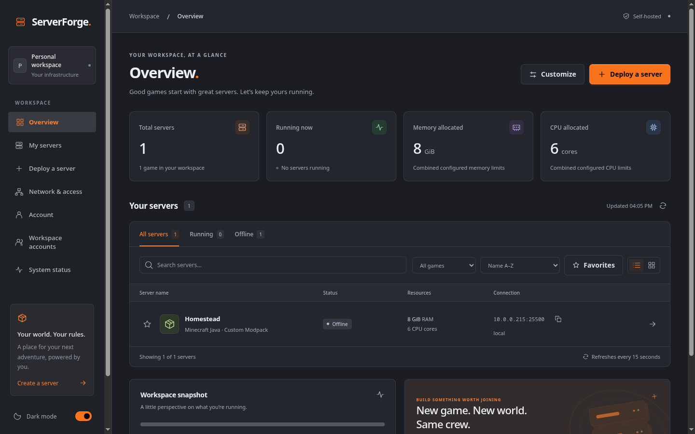
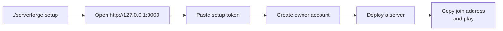
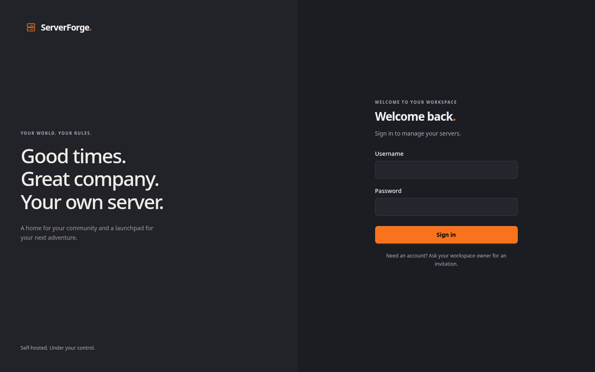
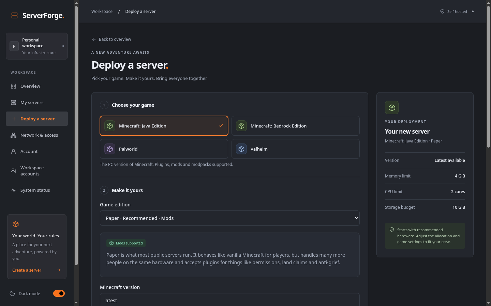
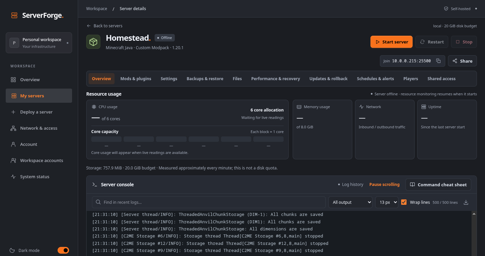
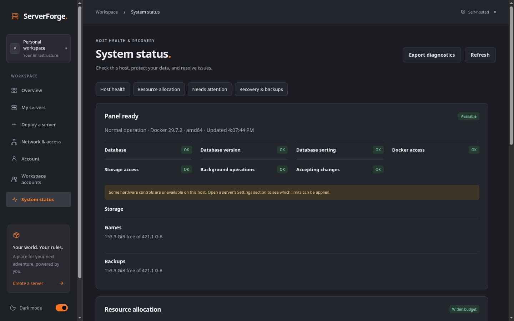
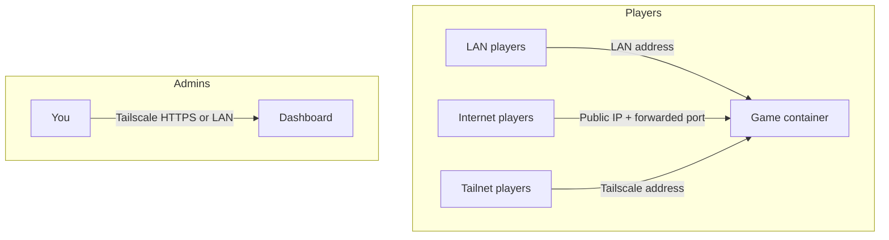
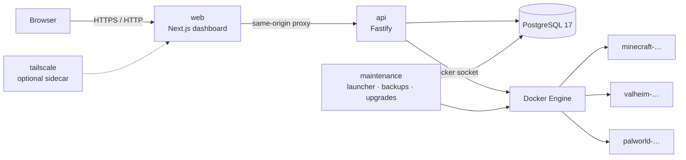

<div align="center">

# ServerForge

**Self-hosted game server hosting on one Docker host — install, configure, mod, monitor and recover Minecraft, Valheim and Palworld servers from a single dashboard.**

[](https://github.com/m1hung/ServerForge/actions/workflows/ci.yml)
[](release.json)
[](#requirements)
[](LICENSE)



</div>

---

## Table of contents

- [Why ServerForge](#why-serverforge)
- [Supported games](#supported-games)
- [Quick start](#quick-start)
- [Day-to-day operations](#day-to-day-operations)
- [Remote access](#remote-access)
- [Architecture](#architecture)
- [Security](#security)
- [Development](#development)
- [Documentation](#documentation)

## Why ServerForge

|                             |                                                                                                                                                             |
| --------------------------- | ----------------------------------------------------------------------------------------------------------------------------------------------------------- |
| **Deploy in minutes**       | Pick a game and edition, name it, and ServerForge downloads the runtime, allocates ports and memory, and tracks install progress until the server is ready. |
| **Everything in one place** | Live console, resource graphs, settings, files, mods, backups, schedules, updates and rollback — all from the server page.                                  |
| **Built to recover**        | Crash detection with back-off restarts, game backups, daily panel backups, full recovery bundles, and a launcher that restores onto a fresh host.           |
| **Share safely**            | Invitation-only accounts, per-server roles, TOTP, scoped API keys and an audit log. Give a friend console access without giving them the host.              |
| **Reach players anywhere**  | Local, public and Tailscale addresses out of the box, with opt-in UPnP for port forwarding and private HTTPS dashboard access.                              |
| **Yours to brand**          | Runtime `BRAND_*` variables rename and recolour the whole product. No custom image builds.                                                                  |

## Supported games

| Game                           | Editions                                                                                                 |
| ------------------------------ | -------------------------------------------------------------------------------------------------------- |
| **Minecraft: Java Edition**    | Vanilla, Paper, Purpur, Fabric, Forge, NeoForge, Modrinth modpacks, uploaded CurseForge server-pack ZIPs |
| **Minecraft: Bedrock Edition** | Official Bedrock Dedicated Server, native worlds, behavior and resource packs                            |
| **Valheim**                    | Dedicated server, BepInEx                                                                                |
| **Palworld**                   | Dedicated server, compatible Linux PAK mods                                                              |

The deployment wizard labels each game / loader / platform combination as supported, experimental or unsupported. See [mod compatibility](docs/modded-servers.md) and [Bedrock notes](docs/minecraft-bedrock.md). New games can be added with a JSON manifest — see [adding a game](docs/adding-a-game.md).

## Quick start

### Requirements

- **Docker Engine 24+** or **Docker Desktop** (Linux containers) with **Compose 2.24+**
- Linux x86-64 / ARM64, macOS (Intel or Apple Silicon), or Windows via **WSL2**
- **2 GiB** of RAM for the panel, plus whatever your games need
- Internet access for game downloads

> **Windows:** run everything inside a WSL2 distribution and keep the install under its Linux filesystem (e.g. `~/serverforge`), not `/mnt/c`.
> **macOS:** share the install directory with Docker Desktop in _Settings → Resources → File sharing_.

### 1 · Install

Unpack the release archive for your architecture, then:

```bash
# verify, load the images, and run setup
sha256sum -c SHA256SUMS            # macOS: shasum -a 256 -c SHA256SUMS
docker load -i serverforge-images.tar
chmod +x serverforge

export SERVERFORGE_HOME="$HOME/serverforge"
./serverforge setup                # add --port 3030 to change the dashboard port
```

Setup generates database credentials and secrets, starts PostgreSQL, applies migrations, and waits until the dashboard is healthy. It refuses to overwrite an existing installation.

### 2 · Claim the workspace

Setup prints a **loopback URL** and a **one-time owner setup token**. Open the URL, paste the token, and create the first owner account. The dashboard is invitation-only from then on.



Lost the token before finishing? `./serverforge setup-token` issues a new one while no accounts exist.

<p align="center"></p>

### 3 · Deploy a server

Click **Deploy a server**, choose a game and edition, set a name, and accept the recommended hardware. The summary card on the right updates as you go.

<p align="center"></p>

The server page shows install progress live; when it flips to _Offline_, press **Start** and copy the join address into your game.

<p align="center"></p>

### 4 · Let players in

By default the dashboard listens on `127.0.0.1` only. When you're ready:

```bash
./serverforge access lan --bind 192.168.1.20    # dashboard on your LAN
./serverforge network --lan-address 192.168.1.20 # tell games their LAN address
```

See [Remote access](#remote-access) for public and Tailscale options.

## Day-to-day operations

Keep `SERVERFORGE_HOME` set (or run from that directory).

| Command                           | What it does                                           |
| --------------------------------- | ------------------------------------------------------ |
| `./serverforge status`            | Service health, versions, and running games            |
| `./serverforge start` / `stop`    | Start or stop the panel — game containers keep running |
| `./serverforge backup`            | Verified panel backup (database + configuration)       |
| `./serverforge backup --full`     | Full recovery bundle including game data               |
| `./serverforge diagnostics`       | Redacted diagnostic report for troubleshooting         |
| `./serverforge upgrade <version>` | Backed-up, migration-aware upgrade with rollback       |

Inside the dashboard, every server has tabs for **Overview** (console + resources), **Mods & plugins**, **Settings**, **Backups & restore**, **Files**, **Performance & recovery**, **Updates & rollback**, **Schedules & alerts**, **Players** and **Shared access**. Right-click any server on the overview for quick actions — start, stop, settings, backups, or delete.

**System status** shows host health checks, storage, how much of Docker's memory and CPU your games have claimed, anything that needs attention, and the exact backup commands to run.

<p align="center"></p>

Keep verified recovery bundles **off-host**; a local backup does not survive losing the machine. Read [operations](docs/operations.md) before upgrading or restoring.

## Remote access



| Need                               | How                                                                                 |
| ---------------------------------- | ----------------------------------------------------------------------------------- |
| Friends on the same Wi-Fi          | Share the **Local network** address from the server's _Share_ panel                 |
| Friends over the internet          | Forward the game port on your router, or enable **UPnP** (per server, owner opt-in) |
| Manage the dashboard from anywhere | `./serverforge access sidecar` starts a dashboard-only Tailscale device with HTTPS  |
| Custom hostname                    | Point a DNS record at your public IP and set it in **Network & access**             |

Details, CGNAT caveats and troubleshooting: [networking](docs/networking.md).

## Architecture



- **One Compose project per installation**, with its own database, secrets, ports and data directories.
- **Game containers** run as a non-root user with all capabilities dropped, hard memory/CPU limits, and their data bind-mounted from `data/servers/<id>`. Containers are named after the server (`survival-world-<id>`), so `docker ps` reads the same as the dashboard.
- **Versioned migrations** and image-based upgrades; the launcher takes a verified backup before every upgrade and can roll back.

More in [architecture](docs/architecture.md).

## Security

The Docker socket grants control of the host — run ServerForge on a dedicated machine or VM and limit who is a workspace administrator.

- Argon2 passwords, TOTP second factor with recovery codes, rate-limited sign-in
- Per-server roles with allow/deny permissions, scoped API keys, audit log
- Destructive actions (deleting servers, changing recovery policy) require re-entering your password
- Path containment for every file operation; uploads are size-limited and type-checked
- Pinned image builds with scanned dependencies and tracked exceptions

Full write-up: [security](docs/security.md).

## Development

```bash
npm ci
npm run bootstrap        # copies .env.example → .env and generates secrets
npm run stack:up         # PostgreSQL + Redis in Docker
npm run db:migrate && npm run db:seed
npm run dev              # API on :8080, dashboard on :3000
```

Requires **Node 22.12+**. The API's file-access protections need Linux (`/proc`) — use WSL2 on Windows or run the API in its container on macOS.

| Check                                  | Command                             |
| -------------------------------------- | ----------------------------------- |
| Types, lint                            | `npm run typecheck && npm run lint` |
| Unit tests                             | `npm run test:unit`                 |
| Integration (isolated Compose project) | `npm run test:integration`          |
| Packaged browser tests                 | `npm run test:packaged`             |
| Image scans                            | `node scripts/scan-images.mjs`      |

Layout: `apps/api` (Fastify), `apps/web` (Next.js), `packages/core` (contracts, permissions), `packages/adapters` (game manifests and installers), `packages/db` (Prisma), `packages/maintenance` (launcher, backups, upgrades).

## Documentation

|                                                                                    |                                                                 |
| ---------------------------------------------------------------------------------- | --------------------------------------------------------------- |
| [Setup](docs/setup.md)                                                             | Fresh install, adopting a source install, runtime configuration |
| [Using the dashboard](docs/dashboard.md)                                           | Deploying, tools, sharing, account security                     |
| [Operations](docs/operations.md)                                                   | Backups, recovery, upgrades, rollback                           |
| [Networking](docs/networking.md)                                                   | Addresses, UPnP, Tailscale, troubleshooting                     |
| [Security](docs/security.md)                                                       | Threat model and protections                                    |
| [Modded servers](docs/modded-servers.md) · [Bedrock](docs/minecraft-bedrock.md)    | Compatibility matrices                                          |
| [Adding a game](docs/adding-a-game.md)                                             | JSON manifests for new games                                    |
| [Architecture](docs/architecture.md) · [Release report](docs/release-candidate.md) | Internals and qualification status                              |

## Status

`0.1.0-rc.2` — Linux / Docker Desktop validation complete, including a four-hour soak. Windows and macOS platform qualification is in progress; see the [release report](docs/release-candidate.md) before relying on a game/loader/platform combination for worlds you care about.

## Licence

[AGPL-3.0-or-later](LICENSE)
