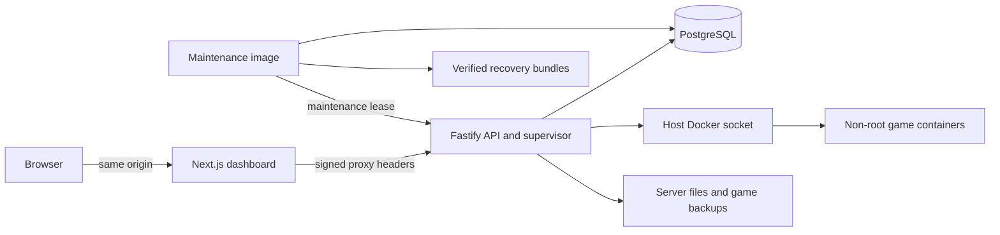

# Architecture

ServerForge runs one API process and one supervisor per installation. PostgreSQL
is the source of truth. The Next.js dashboard proxies API requests and console
streams through its own origin; the packaged API and database have no published
host ports. Redis and a separate queue service are not required by the release
Compose file.

The Docker socket gives the API authority over the host daemon. Keep dashboard
access private and restrict administrator access accordingly. Game containers do
not receive that socket. They run as UID/GID 1000, with dropped capabilities,
no-new-privileges, process/resource limits and rotating logs. Ownership repair is
a separate short-lived helper. See [security](security.md).

## Game and runtime code

`packages/adapters` contains the game registry, Minecraft loader logic, compiled
Valheim/Palworld manifests, settings schemas and configuration writers. Manifests
can describe ordinary installs and startup commands; Minecraft retains code for
publisher APIs, runtime selection and modpack inspection. Palworld save/shutdown
uses its authenticated private REST API because a process signal does not prove
a world save completed.

`apps/api/src/runtime` implements the local Docker driver. It reports Docker's
actual resource-control capabilities and applied limits. Saved configuration is
separate from the running container; a configuration fingerprint marks changes
that require restart. Disk allocation is a monitored budget, not a hard quota.

`InstallTools` confines adapter operations to a staging directory. Downloads are
bounded and checked, ZIP traversal/links are rejected, and temporary install
containers receive limits. Explicit platform selection applies to image pulls,
installation and game startup. Compatibility labels do not substitute for real
platform tests.

## State and long operations

Mutations use per-server in-process locks. Installation attempts persist status,
progress, timestamps, cancellation requests and failure reasons in PostgreSQL.
Each retry uses a new staging directory. Uploaded packs survive failure and are
removed after successful installation or explicit failed-upload removal.

Updates, restores and installation completion use a filesystem journal around
atomic directory replacement. Cancellation is refused once that final replacement
begins. On restart the supervisor recovers journals, checks installation markers,
and reconciles containers using ownership labels and exact configured bind paths.
Uncertain jobs become failed or require attention; arbitrary commands/webhooks
are not replayed. Missed cron occurrences are skipped and recorded.

Shutdown closes mutation admission, pauses dispatch, drains bounded active work,
closes streams and disconnects the database. Healthy games remain running when
the panel restarts. Liveness means the process can answer; readiness additionally
checks database/schema, Docker, storage and supervisor health.

Console output uses server-sent events, with bounded buffering and periodic
reconnection to recheck account access. Docker provides live resource readings.
Unavailable per-core counters and stale telemetry remain explicit. Persistent
history is sampled separately from the live display.

## Accounts and maintenance

Local passwords, sessions, API-key hashes, encrypted TOTP secrets, recovery-code
hashes, invitations and audit events live in PostgreSQL. Invitation tokens appear
only in a link fragment and a POST body. Sensitive security changes require the
current password and enabled second factor. Permissions and key scopes are
checked server-side, including streams and file access.

The maintenance image contains migration, backup, restore, installation and
upgrade commands. Committed Prisma migrations replace production `db push`.
Only recognized legacy catalogs can be adopted automatically. Full recovery
bundles combine consistent game files, panel state, configuration and encryption
material; restored games stay offline and restored sessions/keys are revoked.

The backup worker runs the same maintenance image on a schedule. It is not a
second API supervisor. Daily panel backups and explicit full-backup windows are
separate policies. See [operations](operations.md) for recovery and rollback.

Multiple API replicas, multi-host orchestration, billing, SMTP and integrated
cloud backup storage are outside this candidate's scope. Qualification status
and remaining work are recorded in [the release report](release-candidate.md).
